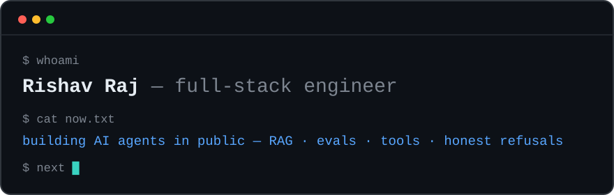
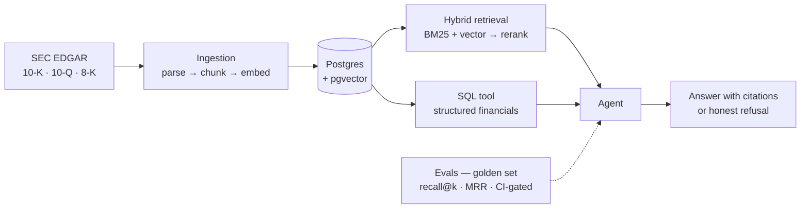

Hi, I'm **Rishav** — a full-stack engineer who got tired of demos that die the moment real data shows up.

By day I build and run production services: Next.js + TypeScript frontends, Python backends. The rest of the time I'm retooling into **AI engineering** — properly, not tutorial-style: retrieval quality you can *measure*, agents that cite their sources, and evals that block a bad PR before it merges.

I like problems where the hard part is honesty. A 300-page SEC filing that *almost* answers your question is more dangerous than one that clearly doesn't — so my projects are built around knowing the difference.

## Building in public

### 🚧 [fin-research-agent](https://github.com/iamrishavraj1/fin-research-agent) — AI research assistant over SEC filings

Ask *"Which company grew revenue fastest after its 2023 acquisition?"* → get a **cited answer**, or an honest *"the filings don't say."*

- Hybrid retrieval (BM25 + pgvector) — measured with recall@k and MRR, not vibes
- A raw, no-framework tool-using agent: document search, SQL over financials, calculator
- An eval suite that gates CI — the part most RAG repos skip
- Architecture, docs and eval design are up; code lands week by week

### ✅ [interview-buddy](https://github.com/iamrishavraj1/interview-buddy) — mock interviews that run 100% on my Mac

Speaks questions out loud (Ollama · qwen3:14b), listens to spoken answers (faster-whisper), and coaches: score /10, filler-word counter, STAR-mode feedback. ₹0 per session, works offline. The interesting bit is the design — the **server** runs the interview (question order, when to push), the LLM only converses. Deterministic control, natural feel.

## How I work

- **Measure, then ship.** Every retrieval or prompt change runs the evals.
- **No framework magic in the core loop.** If I can't explain a line in an interview, it doesn't ship.
- **Boring code, interesting products** — in that order.

## Stack

**Frontend** Next.js · React · TypeScript · Tailwind &nbsp;|&nbsp; **Backend** Python · FastAPI · Postgres + pgvector &nbsp;|&nbsp; **Ops** Docker · GitHub Actions &nbsp;|&nbsp; **AI** Ollama · OpenAI-compatible APIs · faster-whisper

## Elsewhere

**[iamrishavraj1.com](https://iamrishavraj1.com)** &nbsp;·&nbsp; **[@iamrishavraj1](https://x.com/iamrishavraj1)** on X &nbsp;·&nbsp; **[iamrishavraj1@gmail.com](mailto:iamrishavraj1@gmail.com)**
