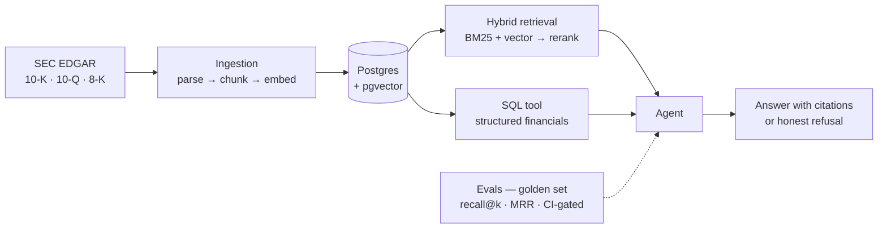

<!-- Profile README for github.com/iamrishavraj1 — paste into the repo named exactly `iamrishavraj1` -->

  

## 👋 Hey, I'm Rishav

**Full-Stack Engineer @ Virohan** — I ship Next.js + TypeScript frontends for a living,
and I'm on a deliberate path into **AI engineering**. Not the "called the OpenAI API once"
kind — the kind with retrieval metrics, eval suites that gate CI, and agents that admit
what they don't know.

What I optimize for:

- 📏 **Measure, then ship** — recall@k before vibes
- 🧱 Systems that survive contact with real, messy data (300-page SEC filings, anyone?)
- ✍️ Clean, boring code the next engineer can actually read

## 🔭 What I'm building

### 🏗️ [fin-research-agent](https://github.com/iamrishavraj1/fin-research-agent) — AI research assistant over SEC filings `building in public`

Ask *"which company grew revenue fastest after its 2023 acquisition?"* and get a cited
answer — or an honest "the filings don't say."

- **Hybrid retrieval** — BM25 + pgvector, fused and reranked, *measured* with recall@k and MRR
- **Tool-using agent** — document search, SQL over extracted financials, calculator; every claim carries a citation
- **Evals as a first-class artifact** — a golden question set scored on every PR, gating CI. Almost nobody builds this; every team wants it
- **Production concerns** — streaming, cost/latency tracking, tracing, prompt-injection defense

### ✅ [interview-buddy](https://github.com/iamrishavraj1/interview-buddy) — a voice interview coach that runs 100% on my Mac `shipped`

It asks questions **out loud**, listens to spoken answers, and coaches — filler-word
counter, score /10, STAR-mode feedback, transcripts. Powered by Ollama (qwen3:14b) +
faster-whisper, so practice costs ₹0 and works offline.

## 🧰 The toolbox

  

## 📊 GitHub stats

  
  

## 🌱 Right now

- 🧪 going deep on **evals & RAG quality** — golden sets, regression gating, retrieval metrics
- 🏗️ studying **system design** — consistency, caching, rate limiting
- 🎙️ dogfooding interview-buddy daily (it roasts my filler words)

## 📮 Reach me

  
  
  

